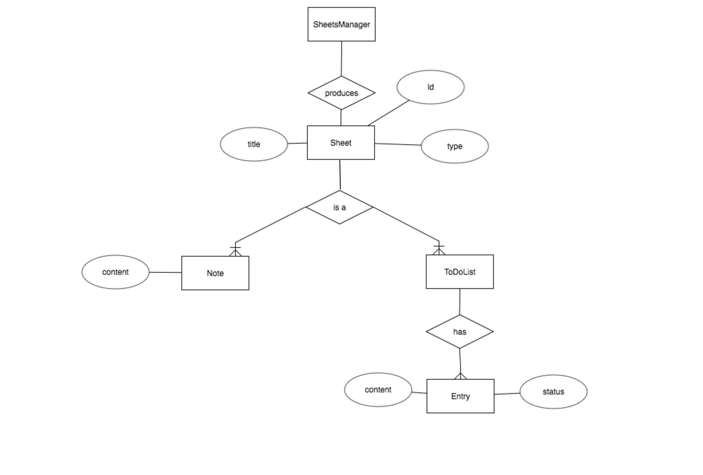

## Craft Demo to simulate an application analogous to Google Keep



### Sample mock server response (GET /sheets)
```
{
  "sheets": [
    {
      "id" : 0,
      "title": "wedding",
      "type": "ToDoList",
      "entries": [
        {
            "status": "true",
            "content": "photography"
        },
        {...},
        {...}
      ]
    },
    {
      "id": 1,
      "title": "tips"
      "type": "Note",
      "content": "do something"
    }
  ]
}
```